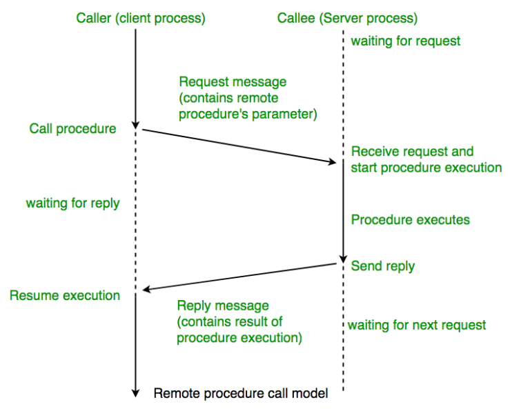
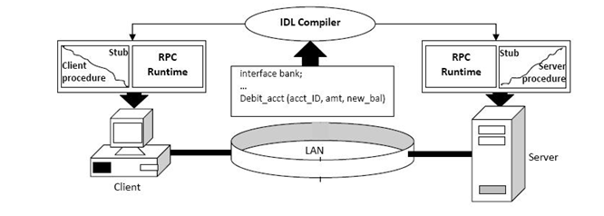
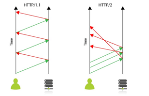
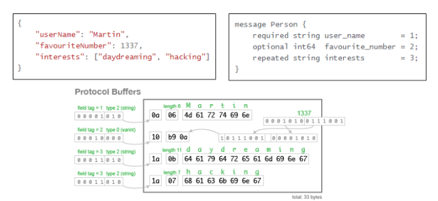
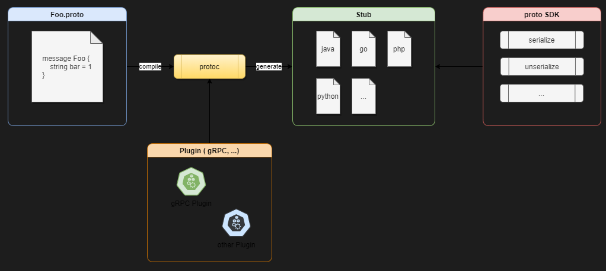

# gRPC(Google Remote Procedure Call)

## RPC란?

원격 프로시저 호출(remote procedure call)은 별도의 원격제어를 위한 코딩 없이 다른 주소공간에서 함수나 프로시저를 실행할 수 있게 하는 프로세스 간 통신 기술



### 프로시저와 함수의 차이

* 함수는 ``인풋에 대비한 아웃풋의 발생`` 을 목적
* 프로시저는 ``결과 값에 집중하기 보단 '명령단위가 수행하는 절차'`` 를 목적으로 한다.

### 장점

* 고유 프로세스 개발 집중 가능(하부 네트워크 프로토콜에 신경쓰지 않아도 됨)
* 프로세스 간 통신 기능을 비교적 쉽게 구현 후 제어 가능

### 단점

* 호출 실행과 반환시간이 보장되지 않음(네트워크가 끊어질경우)
* 보안이 보장되지 않음

### 목표

* 클라이언트-서버 간의 커뮤니케이션에 필요한 상세정보 은닉화
* 클라이언트에서 일반 메소드를 호출하는 것처럼 원격지의 프로시저를 호출
* 서버도 일반메소드를 다루는 것처럼 원격 메소드를 핸들링

### 구성

* IDL(Interface Definition Language)

    프로그래밍 언어에 종속적이지 않은 언어중립적인 방법으로 비즈니스 로직을 표현함

* Stub

    서버와 클라이언트는 서로 다른 주소공간을 사용함으로 변환기의 역할을 담당함

* Marshalling / Unmarshalling

### 구조



1. IDL을 사용하여 호출 규약 정의
2. Stub Code에 명시된 함수는 원시코드 형태로 상세기능은 Server에서 구현
3. Client stub정의 함수 사용
4. Client stub은 RPC runtime을 통해 함수 호출
5. Server는 수신된 procedure호출에 대한 처리 후 결과 값 반환
6. Client는 Server의 결과 값을 반환

## HTTP/2

http/1.1은 클라이언트의 요청이 올때만 서버가 응답하는 구조로 매 요청마다 connection을 생성함. cookie등 많은 메타정보들을 저장하는 무거운 header가 요청마다 중복 전달되어 비효율적이고 느림

http/2는 한 connection으로 동시에 여러개 메시지를 주고 받으며 header를 압축하여 중복 제거 후 전달하기에 효율적임



### ProtoBuf(Protocal Buffer)

Protocal Buffer는 Google에서 개발한 구조화된 데이터를 직렬화 하는 기법

* c++, c#, java, pyton, object c, go 등 다양한 언어 지원
* 직렬화 속도가 빠르며, 용량이 적음
* 직렬화 데이터 파싱 불필요. 데이터 객체 그대로 사용가능
* proto 문법 학습 필요



example) json: 82byte -> protocol buffer: 33byte



## gRPC?

gRPC는 google에서 개발한 오픈소스 RPC(Remote Procedure Call)프레임 워크로 Protocal  Buffer기반 Serizlaizer에 HTTP/2를 결합

* 높은 생산성과 효율적인 유지보수
* 다양한 언어와 플랫폼 지원
* HTTP/2 기반의 양방향 스트리밍
* 높은 메시지 압축률과 성능
* 다양한 gRPC 생태계

#### 서비스 형태

* Unary RPC

    클라이언트에서 요청을 보내고 서버에서 응답을 던짐

* Server streaming RPC

    클라이언트에서 요청을 보내고 서버에서 스트림을 던짐

* Client Streaming RPC

    클라이언트에서 스트림을 서버에 던지고 서버에서 응답 받음

* Bidirectional Streaming RPC

    클라이언트와 서버가 서로 독립적인 스트림을 주고 받음

## PROTOC 설치

1. 설치 파일 다운로드

```bash
$ wget https://github.com/protocolbuffers/protobuf/releases/download/v3.17.3/protobuf-all-3.17.3.tar.gz
```

2. 압축 해제 후 빌드

```bash
$ tar xvf protobuf-all-3.17.3.tar.gz
$ sudo ./configure
$ sudo make
$ sudo make check
$ sudo make install
```

3. 설치 확인

```bash
protoc --version
```

4. 오류 발생시

```bash
sudo ldconfig
protoc --version
```

## GoLang을 사용한 실습

1. go 의존성 설치

```bash
# grpc import
$ go get -u google.golang.org/grpc
$ go get -u github.com/golang/protobuf/protoc-gen-go
```

2. ``.proto `` 파일 작성(IDL 정의)

```protobuf
/*
[ 명명규칙 ]
Service: CalmelCase다(단, 첫 문자는 대문자)
Message: CalmelCase(단, 첫 문자는 대문자)
Field: 밑줄(_)문자를 이용해 작성함
enum: CalmelCase(단, 첫 문자는 대문자)이며 값 이름에 대해서는 대문자와 밑을(_)을 사용한다.
열거탑은 값은 0부터 시작하며, 각 값마다 콤마(,)가 아닌 세미콜론(;)으로 구분한다.
*/

// 버전2와 버전3 중 선택
syntax = "proto3"

// package: 프로토 파일 간에 충돌(중복)을 방지하기 위해 나눈 값
package com.ipron.call

// option: generate로 생성된 소스에 적용될 패키지 명을 설정
option go_pacage = "github/kyh0703/grpc/protos/v1/call"

// service: 인터페이스 정의
service Call {
    rpc GetUser(GetUserRequest) returns (GetUserResponse);
    rpc ListUsers(ListUserRequest) returns (ListUsersResponse);
}

// message: Byte stream으로 직렬화 하기 위한 message타입 정의
message GetUserRequest {
	string user_id = 1;
}

message GetUserResponse {
	UserMessage user_message = 1;
}

message ListusersRequest{
}

message ListUserResponse 
	// Map(key-value)형태로 데이터를 정의
	// map<string, value> user_messages = 1;
	// Array 형태로 데이터를 정의
	repeated UserMessage user_messages = 1;
}
```

